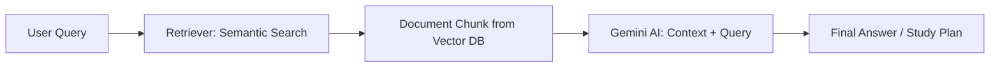

# 🎓 EduMentor - Your AI-Powered Personal Learning Assistant

EduMentor is an intelligent learning assistant that generates **personalized study plans**, delivers **daily learning goals**, explains **complex topics**, and adapts to every student's pace — all powered by **Gemini AI** and **Retrieval-Augmented Generation (RAG)**.

Whether you're learning **DSA, Web Development, or Machine Learning**, EduMentor becomes your always-available **AI mentor** to guide you step by step.

---

## 🚀 Features

- 📅 **Dynamic Study Roadmaps** – AI-generated plans based on your goals and deadlines.
- 🔍 **RAG-Powered Search** – Pulls from curated learning content (PDFs, blogs, YouTube, docs).
- 🧠 **Concept Explainer** – Ask any topic; get simplified explanations and real-world examples.
- ❓ **Daily Practice & Quizzes** – Adaptive quizzes and curated problem sets.
- 📊 **Progress Tracker** – Visual dashboards to monitor consistency and improvement.
- 🧑‍🏫 **Mentor Feedback** – Smart feedback engine to suggest next steps or revisions.

---

## 🛠️ Tech Stack

| Layer            | Tools & Technologies                       |
| ---------------- | ------------------------------------------ |
| 💻 Frontend      | React.js, Tailwind CSS                     |
| 🧠 AI Core       | Gemini Pro API, LangChain, RAG pipeline    |
| 🔍 Vector Search | Pinecone / Weaviate / ChromaDB             |
| 🌐 Backend       | Node.js, Express.js                        |
| 🗃️ Database      | MongoDB / PostgreSQL                       |
| 🔐 Auth          | JWT + Google OAuth                         |
| 📄 PDF Parsing   | pdf-parse, LangChain document loaders      |
| ☁️ Hosting       | Vercel (frontend), Render/Heroku (backend) |

---

## 🧪 RAG Architecture (Simplified)



---

## 🚀 Getting Started

### Prerequisites

- Node.js (v14 or higher)
- npm or yarn
- Groq API key (get it from [Groq Console](https://console.groq.com))

### Installation

1. Clone the repository:

```bash
git clone https://github.com/kalviumcommunity/EduMentor.git
cd EduMentor
```

2. Install dependencies:

```bash
cd Gemini-node-app
npm install
```

3. Create a `.env` file in the Gemini-node-app directory:

```bash
GROQ_API_KEY=your_api_key_here
```

4. Run the application:

```bash
node index.js
```

## 🤖 Zero-Shot Prompting

Zero-shot prompting is a technique where the AI model can understand and perform tasks without any specific training examples. Our implementation uses this approach to:

1. **Understand Context**: The model comprehends queries without predefined patterns
2. **Generate Responses**: Produces accurate answers without task-specific training
3. **Adapt to Various Topics**: Handles different subjects without additional configuration

### Example Prompts

1. **Concept Explanation**:

```
Explain the concept of recursion in programming using a real-world example
```

2. **Code Review**:

```
Review this code snippet for best practices and potential improvements:
[Your code here]
```

3. **Learning Path Generation**:

```
Create a study plan for learning React.js in 3 months for a beginner
```

4. **Problem Solving**:

```
How would you implement a binary search tree in JavaScript?
```

## 🔍 Performance Metrics

Our implementation includes:

- **Response Time Tracking**: Measures API response time for each query
- **Token Usage Monitoring**: Tracks token consumption for optimization
- **Error Handling**: Robust error management for reliable operation
- **Input Validation**: Ensures prompts meet quality standards

### Current Performance

| Metric                | Value           |
| --------------------- | --------------- |
| Average Response Time | ~1.5-2 seconds  |
| Token Limit           | 1024 tokens     |
| Maximum Prompt Length | 1000 characters |
| Temperature           | 0.7             |
| Top P                 | 0.9             |

## 🛠️ API Configuration

The API is configured with optimal parameters for educational use:

```javascript
{
  model: "llama3-8b-8192",
  temperature: 0.7,
  top_p: 0.9,
  max_tokens: 1024,
  stream: false
}
```

### Parameter Explanation

- **temperature**: Controls response creativity (0.7 balances accuracy and creativity)
- **top_p**: Nucleus sampling parameter for response diversity
- **max_tokens**: Maximum length of generated responses
- **stream**: Set to false for complete responses rather than streaming

## 📊 Usage Statistics

The application tracks session statistics including:

- Total number of requests
- Average response time
- Token usage per request
- Error rates and types

## 🤝 Contributing

1. Fork the repository
2. Create your feature branch: `git checkout -b feature/AmazingFeature`
3. Commit your changes: `git commit -m 'Add some AmazingFeature'`
4. Push to the branch: `git push origin feature/AmazingFeature`
5. Open a pull request

## 📝 License

This project is licensed under the MIT License - see the [LICENSE](LICENSE) file for details
